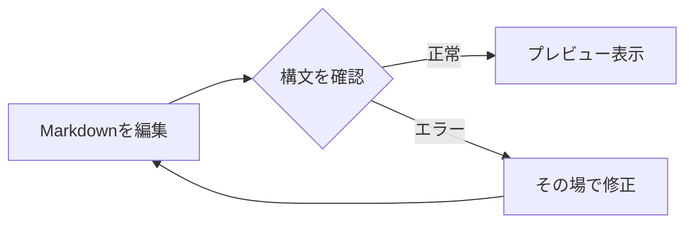
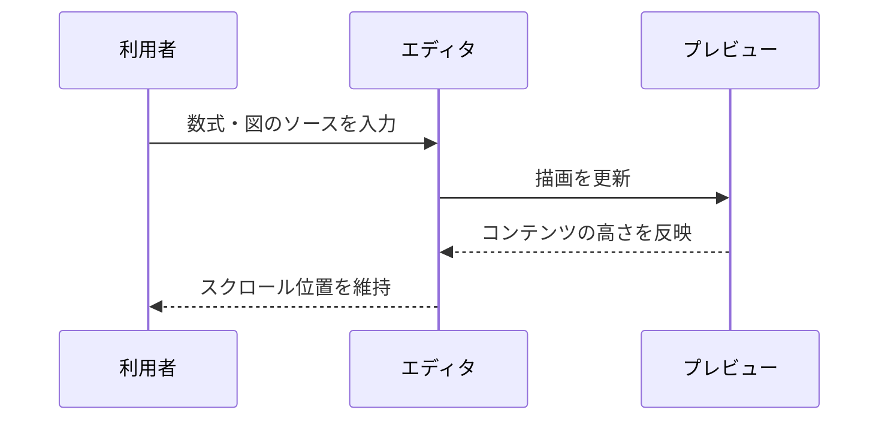

# 数式とMermaid

インライン数式: $E = mc^2$。括弧形式も使えます: \(a^2 + b^2 = c^2\)。

空白付きのインライン数式: $ E = mc^2 $。下付き文字も使えます: $ x_i + y_i $。

## 分数・総和・行列

$$
\sum_{n=1}^{\infty}\frac{1}{n^2} = \frac{\pi^2}{6}
$$

\[
\begin{pmatrix}a & b \\ c & d\end{pmatrix}
\begin{pmatrix}x \\ y\end{pmatrix}
= \begin{pmatrix}ax+by \\ cx+dy\end{pmatrix}
\]

## フローチャート

## シーケンス図

## そのまま表示する記法

コード内の `$x^2$` は数式へ変換しません。料金の $20 や `\$` も区別します。

最終行も上端までスクロールできます。
