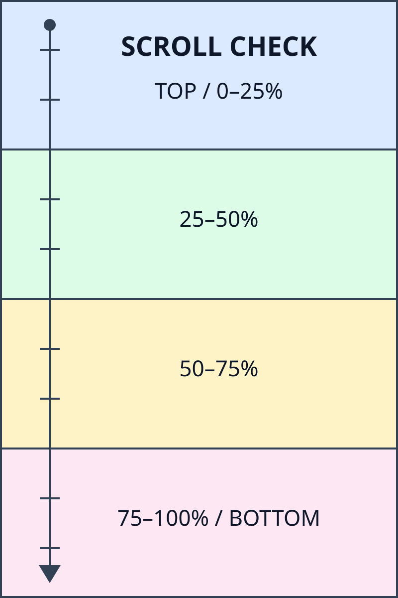

# スクロール検証サンプル

この文書で、左のソースと右のプレビューの位置を比較できます。左・右それぞれでホイール操作とスクロールバーのドラッグを試してください。見出し、表、コード、縦長画像など、表示の高さが異なる内容を並べています。

## 01 · 短い段落

【01-A】この段落の先頭を上端に合わせます。

【01-B】次の段落にも独立した位置があります。**太字**、*斜体*、~~取り消し線~~、`インラインコード`を含んでいます。

【01-C】左右の幅を変更してから、同じ見出しが近い位置に来ることを確認します。

## 02 · 折り返す長い段落

【02-A】この段落はソースでは1行ですが、ペインの幅によって複数の表示行に折り返します。Markdownのソース行の高さと、プレビュー側の段落の高さは同じとは限りません。ウィンドウを狭くした場合や左右の仕切りを動かした場合も、文書内の同じ内容に沿って移動することが確認の目的です。段落の途中にある文字まで左右で必ず一致するものではありませんが、次の段落や見出しへ進むにつれて対応する内容を追えることを確認してください。この部分を編集し、文をいくつか追加してからもう一度スクロールすると、再描画後の対応も試せます。さらに文章を続け、幅が広い状態でも十分な折り返しが生じるようにしています。読みやすい幅とソースを書くための幅を自由に切り替えながら確認できます。

【02-B】こちらも長い段落です。内容に沿った同期では、全体のスクロール量が同じ割合であるだけでは不十分です。例えば下の方に縦長の画像がある場合、画像の前後で高さの比率が大きく変わります。見出しや段落を手がかりに、画像の前は画像の前、画像の後は画像の後を表示することが期待されます。スクロールバーをつまんで先へ飛ぶ操作と、ゆっくりホイールを回す操作の両方を試してください。右側を動かして左が追従すること、その直後に左側を動かして右が追従することも確認対象です。

## 03 · 箇条書きと引用

- 【03-1】最上位のリスト項目です。
  - 【03-1-a】2階層目の項目です。
    - 【03-1-a-i】3階層目の項目です。階層が深いと横幅が狭くなるため、長い文章の折り返しも発生しやすくなります。リストの途中でも大きく別の節へ飛ばないことを確認します。
    - 【03-1-a-ii】3階層目の次の項目です。
  - 【03-1-b】2階層目に戻ります。
- 【03-2】最上位に戻ります。
- [ ] 【03-3】未完了のタスクです。
- [x] 【03-4】完了済みのタスクです。

1. 【03-N1】番号付き項目の先頭です。
2. 【03-N2】番号付き項目の2番目です。
   1. 【03-N2-a】番号付きリストの入れ子です。
   2. 【03-N2-b】入れ子の2番目です。
3. 【03-N3】最後の番号付き項目です。

> 【03-Q1】引用の先頭です。
>
> 【03-Q2】引用内の次の段落です。左右のペインで余白の大きさが異なっていても、引用に対応するソースの範囲内を移動することを確認します。
>
> - 【03-Q3】引用内の箇条書きです。
> - 【03-Q4】引用内の2つ目の項目です。

## 04 · 縦に長い表

【04-前】次は12行の表です。行番号のラベルを目印に、表の途中を両方向にスクロールします。

| 目印 | 項目 | 確認内容 |
| --- | --- | --- |
| 04-T01 | 表の1行目 | ヘッダのすぐ下です。 |
| 04-T02 | 表の2行目 | 短いセルです。 |
| 04-T03 | 表の3行目 | このセルは長くしています。プレビューの幅を狭くすると、ソースの1行に対して複数行分の高さになります。 |
| 04-T04 | 表の4行目 | 長いセルの次の行です。 |
| 04-T05 | 表の5行目 | `code_in_table`を含みます。 |
| 04-T06 | 表の6行目 | **強調されたセル**を含みます。 |
| 04-T07 | 表の7行目 | 表のおよそ中間です。 |
| 04-T08 | 表の8行目 | さらに少し長い内容を置きます。表を下から上へスクロールするときにも、該当する付近へソースが追従することを確認します。 |
| 04-T09 | 表の9行目 | 後半の短い行です。 |
| 04-T10 | 表の10行目 | もう少しで表の末尾です。 |
| 04-T11 | 表の11行目 | 最終行のひとつ前です。 |
| 04-T12 | 表の12行目 | 表の最終行です。 |

【04-後】表を抜けた直後の段落です。

## 05 · 縦に長いコードブロック

【05-前】コードブロックは、内容の各行とソースを対応付けるための確認箇所です。

```python
# 05-C01: コードブロックの先頭
from dataclasses import dataclass


@dataclass
class ScrollMarker:
    section: str
    line: int


def make_markers() -> list[ScrollMarker]:
    markers = []
    for line in range(1, 13):
        markers.append(ScrollMarker("05", line))
    return markers


def print_markers(markers: list[ScrollMarker]) -> None:
    for marker in markers:
        print(f"{marker.section}: {marker.line:02d}")


if __name__ == "__main__":
    entries = make_markers()
    print_markers(entries)
    print("05-C26: コードブロックの末尾")
```

【05-後】コードブロックを抜けた直後の段落です。

## 06 · 縦長の画像

【06-前】画像はソース1行に対し、プレビューでは大きな高さになります。画像の前後が対応し、画像の途中では対応する画像のソース行に留まるか、その範囲内を補間することを確認します。



【06-後】画像の直後の段落です。この段落まで進んだとき、左も画像の後の段落に到達することを確認します。

## 07 · 空行と区切り

【07-A】この下には複数の空行があります。空行はプレビューで同じ数だけ表示されるとは限りません。


【07-B】空行を越えた段落です。

---

【07-C】水平線を越えた段落です。

### 07-D · 小見出し

【07-D1】小見出しの下の内容です。

#### 07-E · さらに小さい見出し

【07-E1】小さい見出しの下の内容です。

## 08 · 文書末尾

【08-A】この節で、文書の末尾まで通常どおり進めることを確認します。

【08-B】さらに下へスクロールすると、最後の行をペインの上端まで移動できる必要があります。下側の余白は画面のためのもので、本文に追記される内容ではありません。

【08-C】左右の仕切りを動かした後、ウィンドウをリサイズした後、本文末尾を編集した後にも同じ操作を試してください。

【最終行】この行を左右それぞれの表示領域の先頭までスクロールできます。