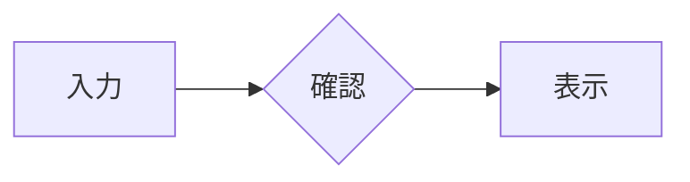

# 2ペイン Markdown エディタ

Markdownのソースとプレビューを左右に並べて使える、Windows向けのエディタです。内容に合わせた左右スクロール同期、保存・編集・検索、画像・HTML・表の貼り付け、画像の外部編集・改名、CSS付きHTML/PDF出力に対応します。TeX数式とMermaidはプレビューと出力の両方で描画します。

## インストールと起動

Python 3.13以上とuvを用意し、このREADMEがある `apps/md-editor/` ディレクトリで実行します。`uv sync --locked` で必要なパッケージをインストールしてから起動します。

```powershell
uv sync --locked
uv run --locked md-editor
```

引数でファイルを開けます。複数ファイルはそれぞれ別ウィンドウで開きます。

```powershell
uv run --locked md-editor "C:\Documents\メモ サンプル.md"
uv run --locked md-editor --sample
```

引数なしでは新規文書を開きます。サンプルは未保存のコピーとして開き、名前を付けて保存できます。

## 編集と保存

左上には新規・開く・保存・元に戻す・やり直すのボタンがあります。Undo／Redoは編集メニューと共通の履歴を使い、実行できない操作は薄く表示します。

| 操作 | メニュー／キー |
| --- | --- |
| 新規／開く／保存／別名保存 | Ctrl+N / Ctrl+O / Ctrl+S / Ctrl+Shift+S |
| Undo／Redo | Ctrl+Z / Ctrl+Y |
| 検索／置換 | Ctrl+F / Ctrl+H |
| 次／前を検索 | F3 / Shift+F3 |
| プレーンテキスト貼り付け | Ctrl+Shift+V |
| 文字コード・改行変更／文字コード指定の再読込 | ファイルメニュー |
| アプリの設定 | ファイル → 設定… |
| 表の作成 | 挿入 → 表…（右クリックからも操作可能） |
| ライト／ダーク／システムと同じ | 表示 → テーマ |
| ソースのフォント・文字サイズ | 表示 → ソースのフォント… |
| プレビューの拡大・縮小 | 表示 → プレビューの倍率 |
| ソースのみ／プレビューのみ／ソース+プレビュー | 表示 → 表示対象、またはメニューバー右端のアイコン |

タイトルバーの左にアプリアイコンと新規・開く・保存のアウトラインアイコンを配置し、中央にはファイル名と未保存変更の `*` を表示します。表示対象はメニューバー右端の3つのアイコンでも切り替えられ、最後の選択を次回起動時に引き継ぎます。スクロール同期・折り返し・先頭／最終行への移動は表示メニューから操作します。

表示を切り替えても、本文・選択・左右の幅とスクロール位置を保持します。プレビューのみ表示中のコピー／すべて選択はプレビューに対して動作し、検索・置換や貼り付けなどソースを操作する機能はソースを表示して実行します。

左右の縦・横スクロールバーは、同じ幅・角丸のつまみ・配色で統一しています。メニューと右クリックメニューも、その文書ウィンドウのライト／ダーク／システム設定に従います。検索欄や表のセル・行列番号のメニューも同様です。

Markdownの見出し、強調、リンク、画像、表、引用、コードなどを色分けします。Tab / Shift+Tabは2スペースを基本に字下げ／解除し、複数行選択にも対応します。リストでは親の本文位置に合わせ、Enterで項目を継続します。空の項目からの退出と2段階のBackspace操作にも対応します。番号付き・タスク・引用・コードの文脈を区別し、日本語IMEの変換中は編集補助を適用しません。

検索は件数表示、大小文字の区別、正規表現、前後移動に対応します。置換・全置換はUndo可能です。正規表現の置換には `\1` や `\g<name>` を使えます。

読み込みではBOM、UTF-8、従来の日本語文字コード等とCRLF / LF / CRを認識し、保存時に元の形式と末尾改行の有無を保ちます。推定した文字コードはステータスバーに表示します。誤判定時は文字コードを指定して開き直せます。改行混在時は保存前に統一先を選び、現在の文字コードで表現できない文字がある場合はUTF-8への変更を選択できます。

「ファイル → 設定…」で画像編集アプリ、デフォルトで開くフォルダ、新規文書の文字コード・改行コードを指定できます。形式の既定値は次に作成する新規文書から適用します。開いた文書は認識した形式を維持し、現在の文書だけ変更する場合は「ファイル → 文字コード・改行コード…」を使います。フォルダ設定は「開く」、画像ファイルの挿入、新規文書の「名前を付けて保存」の初期フォルダに使います。

未保存変更がある新規作成・開く・終了には保存確認を表示します。外部で変更されたMDは未編集なら再読み込みし、編集中なら本文を維持して保存時に競合を確認します。

## 貼り付けと表

- コピーしたHTMLはMarkdownへ変換します。Markdownやコードとして判定した内容、コードブロック内への貼り付け、HTMLのコード部分ではプレーンテキストを優先します。「貼り付け」の直下にある「形式を指定して貼り付け」から、プレーンテキスト／Markdown／コードブロック／引用／表を選べます。「Markdownとして貼り付け」はHTMLがあれば変換し、プレーンテキストのみならそのまま貼り付けます。
- 「コードブロックとして貼り付け」はプレーンテキストを使い、内容から言語をオフラインで推定してコードフェンスに付けます。判断が曖昧なら言語指定なしにします。インデントや記号を保ち、内容にバッククォートのフェンスが含まれていても途中で閉じない長さで囲みます。既存のトップレベルのコードフェンス本文内では、現在の言語指定を維持し、必要ならフェンスを長くして貼り付け内容を保ちます。
- 「引用として貼り付け」は空行も含めて各行に引用記号を付けます。プレーンテキストがあればそれを保持し、HTMLしかない場合はMarkdownへ変換して引用します。どちらの操作も選択範囲の置換、前後の本文との段落分離、1回のUndoに対応します。
- クリップボード画像と画像ファイルのコピーに対応します。「挿入 → 画像ファイル」でも取り込めます。クリップボード画像はPNG、ファイルは元形式を保ち、MDの隣の `img/MD名_00001.png` 等へ衝突しない番号で保存します。
- MD未保存時の画像は一時フォルダへ保存し、初回保存時に保存先とMD名を解決します。別フォルダへの別名保存では現在参照している管理画像をコピーし、元ファイルを保持します。保存による参照変更をUndo／Redoした場合も画像を表示できます。
- CSV／TSVは編集メニューまたは右クリックの「形式を指定して貼り付け → 表として貼り付け…」からダイアログを開きます。区切り文字、1行目をヘッダーにするか新しくヘッダーを追加するかを選択できます。数値の先頭ゼロも文字列として維持します。
- 「挿入 → 表…」で「表を作成」ダイアログを開き、セルを編集してOKを押すとカーソル位置へ表を挿入します。ソースの右クリックにも同じ「挿入」サブメニューがあり、表や画像ファイルを挿入できます。
- Markdownの表は右クリックの「表を編集…」で編集できます。行番号の右クリックから上／下への行挿入、列番号の右クリックから左／右への列挿入を選べます。削除・移動も番号の右クリック、列寄せは列番号の右クリックで操作します。列幅は手動で調整でき、最後の列をウィンドウ幅へ引き伸ばしません。セル内改行はShift+Enter、確定はEnterです。
- 表ダイアログはキャンセルで本文を維持し、確定した変更は1回のUndoで戻せます。引用・リスト内の表は外側の構文を保ちます。

ソースの右クリックメニューはアプリメニューと共通の日本語表記・順序です。プレビュー、検索欄、表のセル編集欄の右クリックも日本語で表示します。

## TeX数式とMermaid

数式は `$E=mc^2$` または `\(E=mc^2\)` でインライン表示します。`$ E=mc^2 $` のように区切り記号の内側に空白があっても表示できます。通常の貼り付けではTeXをソースとして判定し、HTMLが併存していても下付き文字等をエスケープせずに保持します。独立した数式は `$$...$$` または `\[...\]` で囲みます。改行を含む分数・総和・行列等も使えます。コード内の記法やエスケープしたドル記号は数式へ変換しません。

```text
$$
\sum_{n=1}^{\infty}\frac{1}{n^2} = \frac{\pi^2}{6}
$$
```

Mermaidは言語名を `mermaid` としたコードフェンスで描画します。

````markdown

````

数式は[KaTeXの対応構文](https://katex.org/docs/supported.html)、図は[Mermaidの構文](https://mermaid.js.org/intro/)を使います。数式や図の描画にインターネット接続は不要です。描画エラーは元の式・図のソースとともにその場に表示し、修正すると再描画します。ライト／ダーク変更時も図を更新し、高さの変化をスクロール同期へ反映します。

[数式・Mermaidサンプル](examples/math-mermaid.md)で記法を試せます。

```powershell
uv run --locked md-editor examples/math-mermaid.md
```

## 画像の編集・改名

- ソースの画像構文を右クリックすると、現在の文書が参照する `img` 配下の画像だけ「画像を編集」「ファイル名を変更…」を表示します。画像編集はPNG/JPEG等のラスターに限り、既定ではペイントで開きます。「ファイル → 設定…」の画像編集アプリ欄で実行ファイルを変更できます。
- 外部アプリで画像を保存すると、通常プレビューの画像も更新します。
- 「ツール → 画像ファイル名を一括変更…」で、参照が残る管理画像の変更前・変更後の名前を確認できます。プレフィックス・開始番号・連番の最小桁数を指定すると候補を更新します。たとえばプレフィックス `図-`、開始番号 `10`、桁数 `4` なら `図-0010.png` から採番します。既定のプレフィックスは `MD名_` です。確定前に名前を個別に編集することもできます。未参照画像は操作しません。拡張子は維持し、既存名やUndo履歴で使用中の名前への衝突を防ぎます。
- 保存済み文書の改名は**現在のMarkdown本文の保存も伴います**。画像の準備と本文の安全保存を行い、失敗時には元の参照を維持します。改名は1回のUndoで戻せ、戻した後も画像を表示できます。
- 旧名の画像はUndo用に保持し、終了時に保存済み本文から不要になったものだけ整理します。同じフォルダの別Markdownからの共有参照がある画像は残します。別フォルダの文書は共有参照の確認対象外です。
- 中断した改名は対象文書を開く時に整合を確認します。「ツール → 中断した画像操作を復旧…」から画像を含む復旧コピーを開けます。復旧データはアプリのローカルデータ領域の `image-recovery` に保存します。

## 右クリックからの書式変更

ソースの右クリックメニューに「文字の書式」「行・ブロックの書式」があります。選択したまま実行でき、変更後も対象本文を選択し、1回のUndoで戻せます。

- **文字の書式**：太字・斜体・取り消し線・インラインコード。既存書式の中身だけを選んでも設定状態を判定し、混在時は統一と解除を選べます。太字等の部分解除では選択外や他の装飾を保持します。インラインコードの解除はコード範囲全体が対象です。
- **行・ブロックの書式**：標準段落／見出し1〜6、引用、箇条書き、番号付きリスト、コードブロック。行途中の選択も行全体を対象とし、終端が次行の先頭ならその次行を除外します。無選択の場合は現在の行・構造を対象にします。
- コードブロックの設定では言語を自動判定し、本文中のバッククォートと衝突しないフェンスを付けます。一部を選択していても解除はブロック全体が対象となり、メニュー名に「全体」と表示します。解除した本文のMarkdown記号は通常どおり解釈されます。
- 外側の引用やリストなどの所属を保って変換します。コード・数式内部への文字装飾や、複数の段落・セルをまたぐインライン操作など、安全に変換できない選択では該当項目が無効になります。

## プレビューのコードブロック

コードフェンスの言語指定（`python`、`javascript`、`sql`など）に合わせて色分けします。言語未指定なら本文から自動判定し、`text` / `plaintext`、未対応の言語、判定できない断片は通常の文字色で表示します。長大なコードは編集時の応答を優先し、色分けを省略します。配色はライト／ダークテーマに追従します。

各コードブロックの右上にあるコピーボタンで、コード本文だけをコピーできます。インデント・空行・末尾改行を保持し、コピー後は一時的にチェックマークを表示します。HTML・PDF出力にも色分けを反映し、コピーボタンは含めません。

## HTML・PDF出力

「ファイル → 出力プレビュー…」「HTMLを出力…」「PDFを出力…」から共通の出力画面を開きます。開いた時点の編集内容を使うため、未保存の文書も出力できます。

1. 標準の出力スタイルを確認し、必要なら「出力用CSSを追加」でCSSファイルを指定して「プレビューを更新」を押します。追加CSSは通常の左右プレビューには影響しません。
2. 画像・CSS・フォントを出力に埋め込みます。ローカル画像や追加CSSで使う画像・フォントも対象です。外部URLを含む場合は「外部URLの画像・CSSを取得して埋め込む」を選択できます。
3. 準備が完了したら「HTMLを保存…」または「PDFを保存…」を選びます。PDFはA4/A3/A5/Letter、縦横、上下左右の余白を指定できます。用紙・余白の選択はCSSの `@page` より優先します。

HTMLはUTF-8の単体ファイルとして、出力プレビューの内容を保存します。数式・Mermaidの図や埋め込んだ画像・フォントは、インターネット接続なしで表示できます。通常のローカルリンクは元の場所へのリンクとして保持しますが、リンク先の文書は出力ファイルへ含めません。PDFも出力プレビューの内容を使って生成します。2MBを超えるHTMLのプレビューに対応し、通常プレビューの末尾スクロール用余白は出力に含めません。

欠損画像・取得できない依存先・未対応の外部SVG要素参照などは画面下に一覧を表示し、修正して更新するまで保存を無効にします。外部取得には時間・サイズ・依存数の上限があります。画面上のHTMLプレビューはページ区切りのプレビューではなく、PDFの改ページは印刷用CSSと用紙設定で決まります。

## フォントと表示倍率

「表示 → ソースのフォント…」で左ペインのフォントと文字サイズ（6〜72pt）を選べます。「ソースのフォントを標準に戻す」でCascadia Mono・11ptへ戻せます。右ペインは「表示 → プレビューの倍率」の一覧、または「倍率を指定…」で25〜500%に変更でき、100%で標準倍率へ戻ります。

設定は次回起動時にも引き継ぎます。変更時は上端の内容位置を保持して左右同期を続けます。同期OFF時は左右それぞれの位置を保持します。折り返し行の途中は、変更後の表示行単位に丸められます。

## スクロール同期

「表示 → スクロール同期」で、左右のペインが同じ見出しや段落へ追従する動作を切り替えます。「表示 → 最終行を上端へ」で、最後の行を最上部に移動できます。

空行や区切り記号、画像・段落の内部は近くの内容を基準に位置を補間します。左右の全ての文字を同じ高さに並べる仕様ではありません。スクロール用の末尾余白は保存内容に追加しません。

## ビルド（Windows EXE）

Python 3.13以上とuvを用意し、Windows上でこのREADMEがある `apps/md-editor/` ディレクトリから実行します。

```powershell
uv sync --locked
uv run --locked pyinstaller --noconfirm packaging/md-editor.spec
```

実行ファイルは `dist/md-editor/md-editor.exe` に生成されます。移動・配布する場合は、実行に必要なファイルを含む `dist/md-editor/` フォルダ全体を使用してください。

ビルド済みのEXEはPythonやuvを用意せずに直接起動できます。ファイル引数にも対応します。

```powershell
.\dist\md-editor\md-editor.exe
.\dist\md-editor\md-editor.exe "C:\Documents\メモ サンプル.md"
```

Markdownファイルをこのアプリで開く関連付けは、Windowsの「プログラムから開く」などで設定してください。アプリ内に関連付けの設定機能はありません。

開発・検証・設計に関する情報は [DEVELOPMENT.md](DEVELOPMENT.md) を参照してください。
